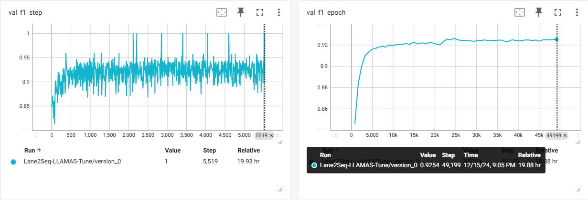

# Partial Implementation for Lane2Seq

## *Note
This repo is an **unofficial** and **partial** implementation for the paper (just one of my homework), resulting limited accuracy and may include errors.


## Reference
1. Lane2Seq: Towards Unified Lane Detection via Sequence Generation, [Paper](https://arxiv.org/abs/2402.17172).
2. Simple Implementation of Pix2Seq, [Code](https://github.com/moein-shariatnia/Pix2Seq).
3. Tuning computer vision models with task rewards, [Paper](https://arxiv.org/abs/2302.08242), [Code](https://github.com/google-research/big_vision/blob/main/big_vision/configs/proj/reward_tune/detection_reward.py).
4. LLAMAS dataset, [Code](https://github.com/karstenBehrendt/unsupervised_llamas), [Paper](https://ieeexplore.ieee.org/document/9022318).


## Limits
1. Only for LLAMAS dataset
2. Only grayscale images from LLAMAS without data augmentation.
3. Only try for Anchor representation, no task label (\<seg\>, \<anchor\> and \<param\>), no start-point.


## Environment
```
python >= 3.9
pytorch
pytorch-lightning
timm

numpy
opencv-python
scipy

argparse
```

## Architecture
#### Network

#### MLE Pretrain

#### MFRL Tuning


## Results (Bad, :()
#### MLE Pretrain
The model was trained with 20 epochs and took 2.7 hours, getting **91.84 F1 score** on validation.


#### MFRL Tuning
The model then was tuned with 60 epochs and took 20.1 hours, gettting **92.54 F1 score** on validation (0.7 upgrade).



#### Test
Testing using *next-token-prediction* gots bad results. **Something must be wrong with my LLAMAS data processing, but I got limited time to solve it.**


| Data Scoure    | Stage             | Test F1(%) $\uparrow$ |
| -------------- | ----------------- | --------------------- |
| Original Paper | MLE Pretrain      | **97.05**             |
| Implementation | MLE Pretrain      | **52.62**             |
| Implemnetation | Pretrain + Tuning | **53.99（+1.37）**    |

#### Visualization (Anchors)
Some visualization results while testing. **From left to right:** image, GT, prediction.


